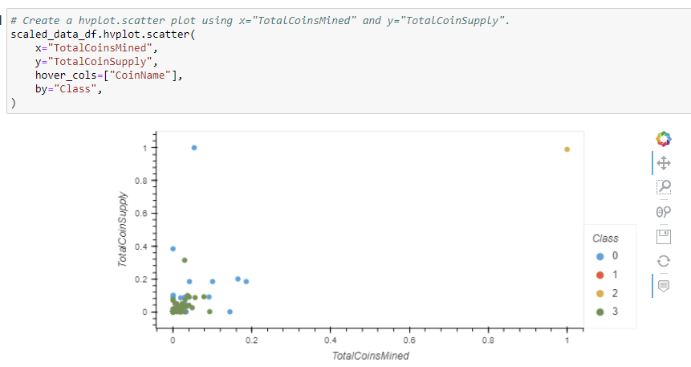
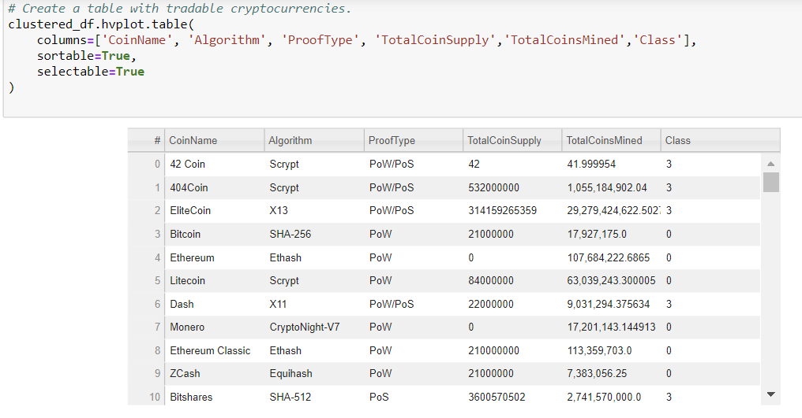

# Cryptocurrencies

This project aims to show what cryptocurrencies are on the trading market and how they can be grouped into a classification system. Reporting these results will help the company Accountability Accounting determine whether they can and should offer a new cryptocurrency investment portfolio for its customers. 

The data used is not ideal and needs to be processed to fit machine learning models. Since there is no known output for what is needed, unsupervised learning is the best option. Cryptocurrencies are grouped using a clustering algorithm and data visualizations will highlight results to share with the board at Accountability Accounting so they can make an investment decision.

# Deliverables for this Project

Deliverable 1: Preprocessing the Data for PCA

Deliverable 2: Reducing Data Dimensions Using PCA

Deliverable 3: Clustering Cryptocurrencies Using K-means

Deliverable 4: Visualizing Cryptocurrencies Results

The Scatter Plot below shows Total Coins Mined and Total Coin Supply, grouped by Class. The user can hover over each dot to see the Coin Name.

The table below shows Tradable Cryptocurrencies, or currencies that can be traded for each other on an exchange.

